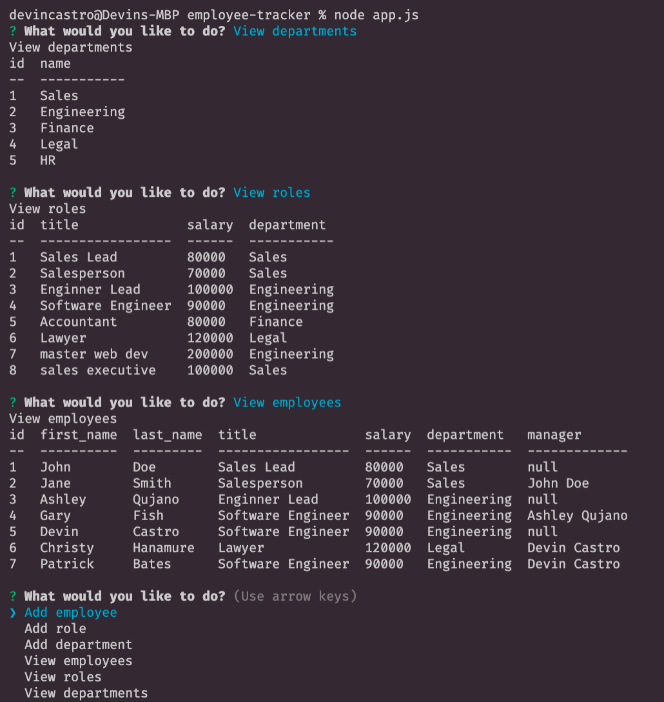

# employee-tracker

Link to Video: https://youtu.be/L6CJpBu-kro

## Description:
>The application allows the user to add employees, departments, and employee roles to a database.  They can also view all employees, departments, and roles.  Lastly the user is able to update any of the employees roles. 

### Usage: 
To use this application, first install the proper npm's by opening up the terminal and using the command, 'npm i'.  Next run the program by typing in the terminal the command, 'node app.js'.  The console will then prompt you, the user, to select what option you want to do.  If you want to view any of the tables, just select the view option with the arrow keys and press enter.  To add an employee, role, or department, select that option and then follow the prompts and enter in the information you are trying to add.  Lastly when you are finished just click 'Finished' and it will stop the program.

### Example of console results:

